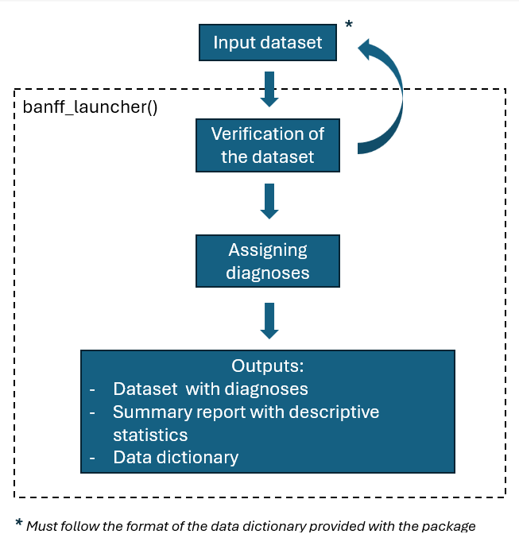

<!-- README.md is generated from README.Rmd. Please edit that file -->

# banffIT

<!-- badges: start -->

[](https://github.com/maelstrom-research/banffIT/actions/workflows/R-CMD-check.yaml)
<!-- badges: end -->

The banffIT package provides functions to assign standardized diagnoses
using the Banff Classification (Category 1 to 6 diagnoses, including
Acute and Chronic active T-cell mediated rejection as well as Active,
Chronic active, and Chronic antibody mediated rejection). The main
function `banff_launcher()`considers a minimal dataset containing
biopsies information in a specific format (described by a data
dictionary), verifies its content and format (based on the data
dictionary), assign diagnoses, and create a summary report.

## Main functionality



<br>

- function `banff_launcher()` This function takes a path string
  identifying the input file path. The function internally runs a series
  of tests that assess the input dataset. If any of these tests fails,
  the user gets information allowing them to correct the input dataset
  and rerun the process. Once all tests pass, the dataset is given as an
  output with a diagnosis for each observation (using the function
  `add_diagnoses()` internally). The output dataset, along with its
  associated labels (“label:en” by default) are provided to the user in
  an Excel format file accessible in the output_folder specified (the
  working directory by default). The output dataset comes with a report
  that summarizes information about variable distributions and
  descriptive statistics.

# Download section

<button>
<a href="https://github.com/PersonalizedTransplantCare/banffIT/blob/testing/inst/extdata/data_dictionary_Banff_2024_04_19.xlsx" download class="external-link">Data
Dictionary</a>
</button>

also available in R using `get_banff_dictionary()` </br>

<button>
<a href="https://github.com/PersonalizedTransplantCare/banffIT/blob/testing/inst/extdata/template.xlsx" download class="external-link">Template</a>
</button>

also available in R using `get_banff_template()` </br>

<button>
<a href="https://github.com/PersonalizedTransplantCare/banffIT/blob/testing/inst/extdata/example.xlsx" download class="external-link">Example</a>
</button>

also available in R using `get_banff_example()` </br>

# Get started

## Install the package and use the example file

This command example runs the diagnosis assignment process on the
dataset specified in the input_file path. The output files will be saved
in path_folder/example. The diagnoses will be displayed in English and
only observation with adequacy == 1 will be taken into consideration due
to the option_filter argument. Finally, the output dataset will contain
variables generated in the process due to the argument “detail” set to
TRUE.

``` r

# To install banffIT
install.packages('banffIT')

library(banffIT)
# If you need help with the package, please use:
banffIT_website()

# use example
input_file = system.file("extdata", "example.xlsx", package = "banffIT")
banff_launcher(
  input_file = input_file,
  output_folder = 'folder_path/example',
  language = 'label:en',
  option_filter = adequacy == 1,
  detail = TRUE)
```
